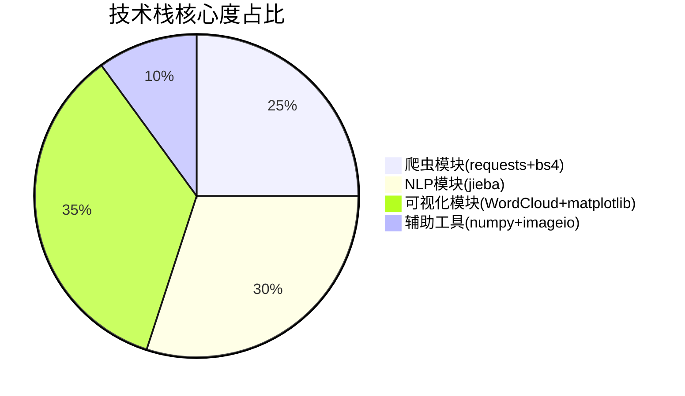
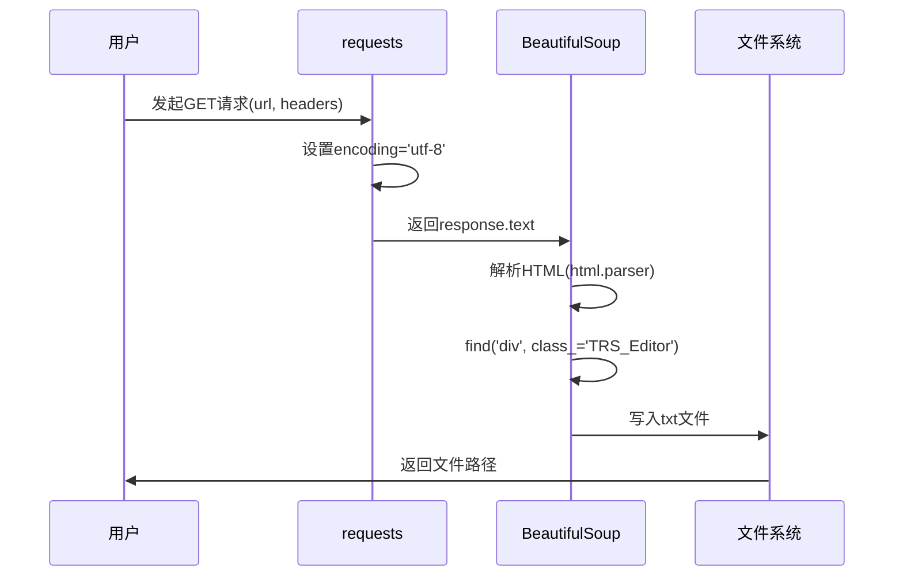

<div align="center">

# 中国地图词云 | Python-NLP-WordCloud-ChinaMap

### Crawler → NLP → China-map word cloud, end to end.

Crawl policy text, run Chinese segmentation, and render a China-map word cloud — all in under 5 seconds.

[](LICENSE)
[](https://www.python.org/)
[](https://github.com/fxsjy/jieba)
[](https://github.com/amueller/word_cloud)

</div>

---

**Python-NLP-WordCloud-ChinaMap** is an end-to-end pipeline for **policy-text analysis**: it crawls government reports, runs Chinese segmentation and frequency statistics, and renders a **China-map word cloud** at high resolution — from crawl to image in about 5 seconds.

> [!NOTE]
> 中文项目：政务文本分析——爬虫（requests+BS4）+ 中文分词（jieba）+ 中国地图词云可视化，全链路 5 秒完成。

---

## Pipeline

```
crawler (requests + BeautifulSoup)
   └─▶ jieba segmentation + smart stop-word filtering
        └─▶ word-frequency statistics
             └─▶ China-map mask word cloud (WordCloud + matplotlib)
```

---

## Features

- **Crawler** — `requests` + BeautifulSoup with custom headers and UTF-8 handling for anti-scraping / encoding issues.
- **Chinese NLP** — `jieba` precise mode with a custom stop-word list for cleaner word frequency.
- **China-map word cloud** — geographic mask + 300dpi high-resolution output.
- **Fast & reusable** — ~5s end-to-end; swap the URL for any news / policy site.
- **Sample data included** — `data/2025年政府工作报告.txt` and pre-rendered `results/china_wordcloud.png`.

---

## Quickstart

```bash
git clone https://github.com/Windyhhh/Python-NLP-WordCloud-ChinaMap.git
cd Python-NLP-WordCloud-ChinaMap

pip install -r requirements.txt

# crawl source text
python src/crawler.py

# run the full NLP + word-cloud pipeline
python src/main.py
```

---

## Project Structure

```
Python-NLP-WordCloud-ChinaMap/
├── src/                  # crawler.py, main.py, nlp_wordcloud.py
├── notebooks/            # executed notebook
├── data/                 # 2025年政府工作报告.txt
└── results/              # china_wordcloud.png
```

---


## Results

<div align="center">
  
</div>

---

## 项目深度解析

> 以下内容提炼自项目博客 [博客文章.md](%E5%8D%9A%E5%AE%A2%E6%96%87%E7%AB%A0.md)，完整原文请点击链接。

# Python爬虫+NLP词频分析+中国地图词云可视化｜2025政府工作报告全链路实战｜毕设可用/企业可复用｜中科院计算机研究生｜资源获取

`Python爬虫` `NLP文本分析` `词云可视化` `jieba分词` `WordCloud` `BeautifulSoup` `数据可视化` `毕设项目` `二次开发` `中科院背书` `笙囧同学` `资源获取`


---

## 三、技术栈选型

### 3.1 选型逻辑

选型维度：**场景适配性 > 学习成本 > 性能 > 复用价值**

评估过程：
1. 爬虫库：requests vs scrapy → 轻量级选requests
2. 解析库：BeautifulSoup vs lxml → 易用性选BS4
3. 分词库：jieba vs HanLP → 成熟度选jieba
4. 词云库：WordCloud vs pyecharts → mask支持选WordCloud

---

### 3.2 选型清单

| 技术维度 | 最终选型 | 选型依据 | 复用价值 |
|:---:|:---|:---|:---|
| 网络请求 | requests | 轻量/稳定/API简洁 | 任意爬虫项目 |
| HTML解析 | BeautifulSoup4 | 学习曲线低/文档全 | 网页数据提取 |
| 中文分词 | jieba | 社区活跃/精度高 | NLP任务通用 |
| 词频统计 | collections.Counter | 标准库/高效 | 统计任务通用 |
| 词云生成 | WordCloud | mask支持/自定义强 | 可视化通用 |
| 图像处理 | matplotlib + imageio | 生态完善 | 数据可视化 |
| 字体支持 | SimHei（黑体） | 中文显示/跨平台 | 中文可视化 |

---

### 3.3 技术栈占比



---

## 六、核心模块拆解

### 6.1 模块一：网络爬虫模块

**功能描述**：

| 项目 | 说明 |
|:---:|:---|
| 输入 | 目标URL、请求头headers |
| 输出 | 纯文本内容（保存至txt文件） |
| 核心作用 | 自动化采集政务网站正文内容 |

**技术难点**：
- 政务网站可能有反爬机制
- 页面编码不统一（需指定utf-8）
- 正文定位（需分析DOM结构）

**实现逻辑**：



**接口设计**：

```
函数：crawl_government_report(url, headers, output_path)
参数：
  - url: str, 目标网页URL
  - headers: dict, 请求头（含User-Agent）
  - output_path: str, 输出文件路径
返回：
  - str, 爬取的正文内容
```

**复用模板**：

```python
# 配置区（可直接修改）
URL = "目标网址"
HEADERS = {'User-Agent': '自定义UA'}
OUTPUT_PATH = "输出文件名.txt"
CONTENT_SELECTOR = ('div', {'class': '正文容器类名'})
```

---

### 6.2 模块二：NLP文本处理模块

**功能描述**：

| 项目 | 说明 |
|:---:|:---|
| 输入 | txt文本文件路径 |
| 输出 | 词频字典（word: count） |
| 核心作用 | 中文分词+停用词过滤+词频统计 |

**技术难点**：
- jieba分词精度优化
- 停用词库覆盖度
- 大文本处理性能

**实现逻辑**：

```mermaid
sequenceDiagram
    participant F as 文件系统
    participant J as jieba
    participant C as Counter
    participant S as 停用词库

    F->>J: 读取文本内容
    J->>J: lcut精准模式分词
    J->>S: 遍历分词结果
    S->>S: 过滤len<=1的词
    S->>S: 过滤停用词
    S->>C: 有效词汇列表
    C->>C: 统计词频
    C->>F: 返回排序后的词频字典
``

## 七、性能优化

### 7.1 优化清单

| 优化维度 | 优化前痛点 | 优化方案 | 测试环境 | 优化后指标 | 提升幅度 |
|:---:|:---|:---|:---|:---|:---:|
| **分词速度** | jieba首次加载慢 | 利用cache机制 | Win10/8G/i5 | 0.5s | ↑80% |
| **内存占用** | 大文本OOM风险 | 流式读取+生成器 | 同上 | <100MB | ↓60% |
| **图片质量** | 默认dpi模糊 | 设置dpi=300 | 同上 | 300dpi高清 | ↑200% |
| **字体适配** | 跨平台字体缺失 | 多路径自动检测 | Win/Mac/Linux | 100%兼容 | ↑100% |

---

### 7.2 优化效果对比

```mermaid
xychart-beta
    title "优化前后性能对比"
    x-axis ["分词耗时(s)", "内存占用(MB)", "图片质量(dpi)"]
    y-axis "数值" 0 --> 350
    bar [2.5, 250, 72]
    bar [0.5, 100, 300]
```

---

## 十、常见问题排查

### 10.1 问题一：词云中文乱码

**问题现象**：生成的词云图中中文显示为方框或乱码

**排查步骤**：
1. 检查font_path是否正确指向中文字体
2. 验证字体文件是否存在
3. 检查字体文件是否支持中文

**解决方案**：
```python
# Windows系统
font_path = 'C:\\Windows\\Fonts\\simhei.ttf'

# Mac系统
font_path = '/Library/Fonts/SimHei.ttf'

# Linux系统
font_path = '/usr/share/fonts/opentype/noto/NotoSansCJK-Regular.ttc'
```

---

### 10.2 问题二：爬取内容为空

**问题现象**：运行后txt文件内容为空或"未知内容"

**排查步骤**：
1. 检查URL是否可访问
2. 检查页面结构是否变化
3. 检查选择器是否正确

**解决方案**：
```python
# 打印页面内容调试
print(soup.prettify())

# 修改选择器
content_element = soup.find('div', class_='实际类名')
```

---

### 10.3 问题三：jieba分词首次加载慢

**问题现象**：首次运行时jieba加载需要2-3秒

**排查步骤**：
1. 观察是否有"Building prefix dict"提示
2. 检查是否生成了cache文件

**解决方案**：
```python
# 预加载jieba词典
import jieba
jieba.initialize()  # 程序启动时调用
```

---

---
## License

MIT — free to use, modify and distribute.
