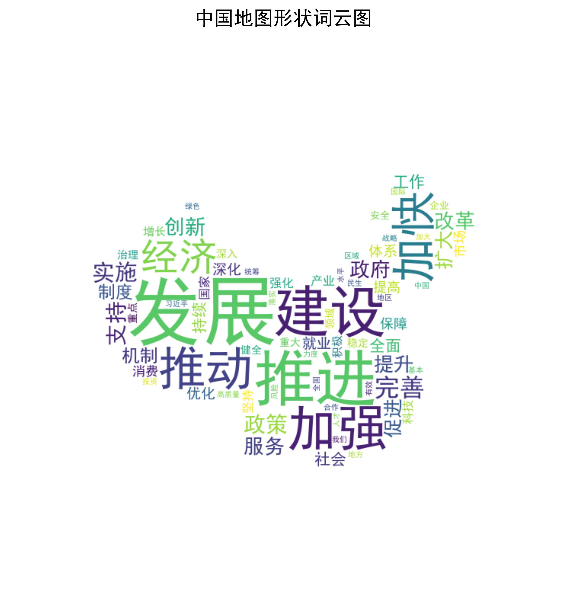

<div align="center">

# 中国地图词云 | Python-NLP-WordCloud-ChinaMap

### Crawler → NLP → China-map word cloud, end to end.

Crawl policy text, run Chinese segmentation, and render a China-map word cloud — all in under 5 seconds.

[](LICENSE)
[](https://www.python.org/)
[](https://github.com/fxsjy/jieba)
[](https://github.com/amueller/word_cloud)

</div>

---

**Python-NLP-WordCloud-ChinaMap** is an end-to-end pipeline for **policy-text analysis**: it crawls government reports, runs Chinese segmentation and frequency statistics, and renders a **China-map word cloud** at high resolution — from crawl to image in about 5 seconds.

> [!NOTE]
> 中文项目：政务文本分析——爬虫（requests+BS4）+ 中文分词（jieba）+ 中国地图词云可视化，全链路 5 秒完成。

---

## Pipeline

```
crawler (requests + BeautifulSoup)
   └─▶ jieba segmentation + smart stop-word filtering
        └─▶ word-frequency statistics
             └─▶ China-map mask word cloud (WordCloud + matplotlib)
```

---

## Features

- **Crawler** — `requests` + BeautifulSoup with custom headers and UTF-8 handling for anti-scraping / encoding issues.
- **Chinese NLP** — `jieba` precise mode with a custom stop-word list for cleaner word frequency.
- **China-map word cloud** — geographic mask + 300dpi high-resolution output.
- **Fast & reusable** — ~5s end-to-end; swap the URL for any news / policy site.
- **Sample data included** — `data/2025年政府工作报告.txt` and pre-rendered `results/china_wordcloud.png`.

---

## Quickstart

```bash
git clone https://github.com/Windyhhh/Python-NLP-WordCloud-ChinaMap.git
cd Python-NLP-WordCloud-ChinaMap

pip install -r requirements.txt

# crawl source text
python src/crawler.py

# run the full NLP + word-cloud pipeline
python src/main.py
```

---

## Project Structure

```
Python-NLP-WordCloud-ChinaMap/
├── src/                  # crawler.py, main.py, nlp_wordcloud.py
├── notebooks/            # executed notebook
├── data/                 # 2025年政府工作报告.txt
└── results/              # china_wordcloud.png
```

---


## Results

<div align="center">
  
</div>

---
## License

MIT — free to use, modify and distribute.
